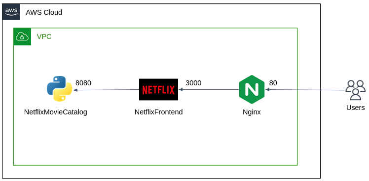

# The Netflix Stack Bootcamp Assignment

## Overview

Throughout this bootcamp, you've been building and deploying components of the Netflix stack.
Now, it's time to bring everything together into a fully functional system.

## Objectives

- Deploy a microservices architecture in EC2 instances, composed of:
  - **Nginx**: As the HTTP engine and reverse proxy.
  - **NetflixFrontend**: A Node.js web app serving as the frontend.
  - **NetflixMovieCatalog**: A Flask-based API for the movie catalog.
- Implement at least one CI/CD pipeline using GitHub Actions to automate deployment of updates to either the NetflixFrontend, NetflixMovieCatalog, or Nginx configuration.

Try to apply as many DevOps practices as we've discussed in class:
   - Use **Docker containers** for all services.
   - Create CI/CD pipelines for all microservices. For the **NetflixFrontend** and **NetflixMovieCatalog** microservices, implement both the **Build** and **Deploy** pipelines. 
   - Access the service via a domain registered and managed through Route 53.
   - Try to deploy highly available architecture by deploying multiple instances of the **NetflixFrontend** service, and configure the **Nginx** to be functioning as a **load balancer**.
   - Provision your EC2 instances and other related infrastructure using IaC tools like Terraform. 

## Submission

- Push your code and configuration files to dedicated GitHub repo.
- Create a `README.md` with detailed information about your project. 
- Present a live, working demo of your work, explain the architecture and demonstrate the CI/CD process.

# Good Luck
